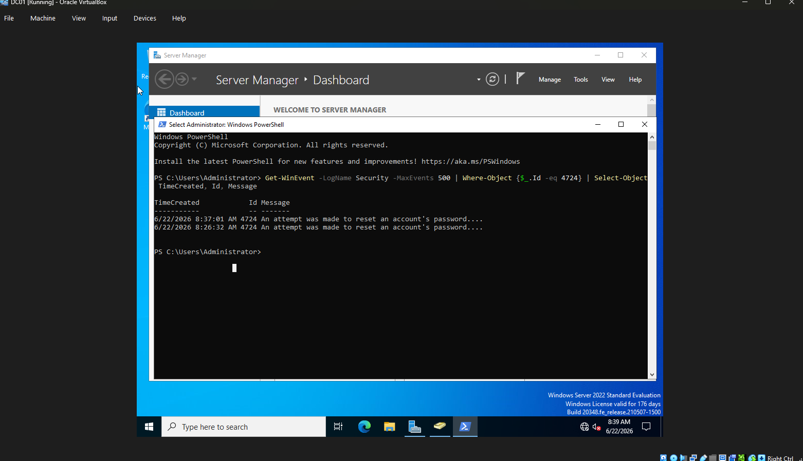
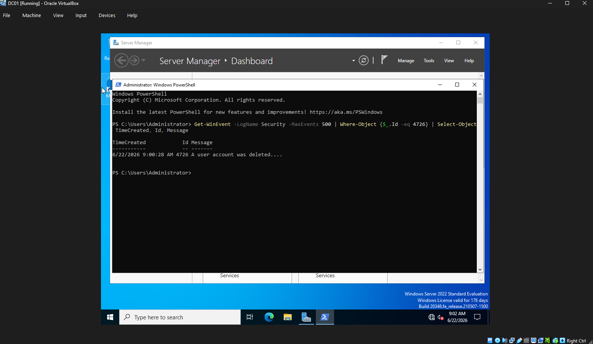
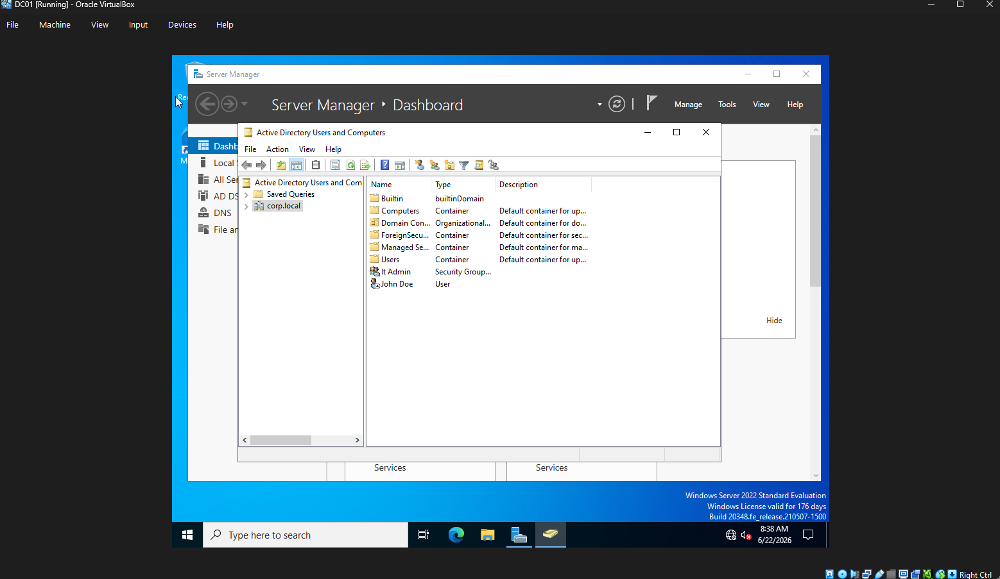
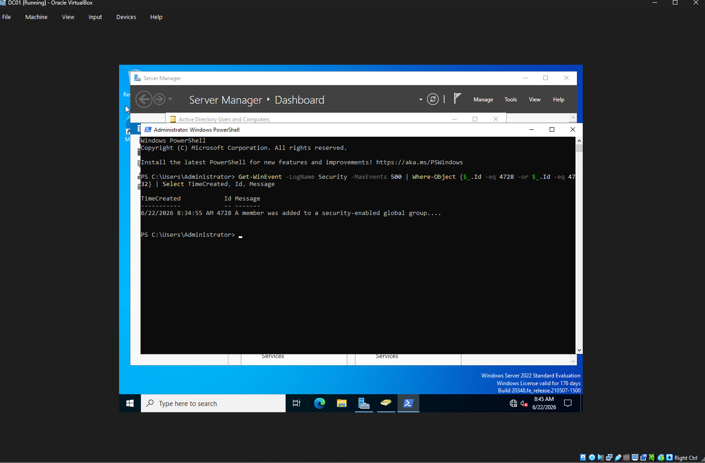

# Active Directory Security Monitoring Lab

## Objective

This project demonstrates the deployment and monitoring of a Windows Active Directory environment. The lab was designed to simulate common security-relevant Active Directory activities and investigate corresponding Windows Security Events from a SOC analyst perspective.

## Environment

### Infrastructure

| System | Role |
|----------|----------|
| Windows Server 2022 | Domain Controller |
| Active Directory Domain Services | Identity Management |
| DNS Server | Name Resolution |
| Splunk Enterprise | Log Collection & Analysis |
| Sysmon | Endpoint Telemetry |

### Domain

corp.local

## Skills Demonstrated

- Active Directory Administration
- Security Monitoring
- Log Analysis
- Incident Investigation
- Detection Engineering
- Windows Event Analysis
- MITRE ATT&CK Mapping
- SOC Operations

## Security Events Investigated

| Event ID | Description |
|----------|-------------|
| 4720 | User Account Created |
| 4724 | Password Reset Attempt |
| 4726 | User Account Deleted |
| 4728 | User Added to Privileged Group |
| 4732 | Security-Enabled Local Group Membership Change |

## Detection Examples

### User Creation Detection

```spl
EventCode=4720
```
### Screenshot

### Event ID 4720 - User Creation


## Password Reset Investigation

### Objective

Investigate Active Directory password reset activity using Windows Security Event ID 4724.

### Action Performed

The password for a domain user account was reset through Active Directory Users and Computers.

### Evidence

| Field | Value |
|---------|---------|
| Event ID | 4724 |
| Description | An attempt was made to reset an account's password |
| Source | Windows Security Log |

### Screenshot

 Event ID 4724 - Password Reset



### MITRE ATT&CK

**T1098 - Account Manipulation**

### Detection Logic

```spl
EventCode=4724
```

### Findings

A password reset operation generated Event ID 4724 in the Windows Security Log. Password resets should be reviewed to ensure they were authorized and performed by approved administrators.

### Recommendation

Monitor password reset activity and investigate unexpected administrative account actions.


## User Deletion Investigation

### Objective

Investigate Active Directory account deletion activity using Windows Security Event ID 4726.

### Action Performed

A test user account was deleted from the Active Directory environment.

### Evidence

| Field | Value |
|---------|---------|
| Event ID | 4726 |
| Description | A user account was deleted |
| Source | Windows Security Log |

### Screenshot

#### Event ID 4726 - User Deletion



### MITRE ATT&CK

**T1070 - Indicator Removal on Host**

### Detection Logic

```spl
EventCode=4726
```

### Findings

A user account deletion event was successfully recorded within the Windows Security Log and attributed to an administrative account.

### Recommendation

Monitor account deletion activity and verify all deletions are approved and documented.


## Privileged Group Membership Investigation

### Objective

Investigate Active Directory privileged group membership modifications using Windows Security Event IDs 4728 and 4732.

### Action Performed

A test user account was added to a privileged Active Directory security group.

### Active Directory Configuration

The following screenshot shows the Active Directory environment containing the user account and privileged security group.



### Evidence

| Field | Value |
|---------|---------|
| Event ID | 4728 |
| Description | A member was added to a security-enabled global group |
| Source | Windows Security Log |

### Screenshot

#### Event ID 4728 - Group Membership Change



### Security Relevance

Unauthorized additions to privileged groups may indicate privilege escalation or persistence mechanisms used by threat actors.

### MITRE ATT&CK

**T1098 - Account Manipulation**

### Detection Logic

```spl
EventCode=4728 OR EventCode=4732
```

### Findings

A privileged group membership modification was successfully identified within the Windows Security Log. The event recorded the addition of a user account to a security-enabled group.

### Recommendation

Monitor privileged group membership changes and verify that all modifications are authorized and documented. Investigate unexpected additions to administrative or privileged groups immediately.


## Conclusion

This project demonstrated the deployment and administration of an Active Directory environment using Windows Server 2022. Multiple security-relevant account management activities were performed and investigated through Windows Security Logs.

Activities investigated included:

- User Account Creation (Event ID 4720)
- Password Reset Activity (Event ID 4724)
- User Account Deletion (Event ID 4726)
- Privileged Group Membership Changes (Event ID 4728/4732)

The project provided hands-on experience with Active Directory administration, Windows Security Event analysis, PowerShell log investigation, and MITRE ATT&CK mapping from a SOC analyst perspective.

## Skills Demonstrated

- Active Directory Administration
- Windows Server 2022
- User and Group Management
- Windows Event Logging
- Security Monitoring
- Event Investigation
- PowerShell
- Detection Engineering
- MITRE ATT&CK Mapping
- Security Documentation
