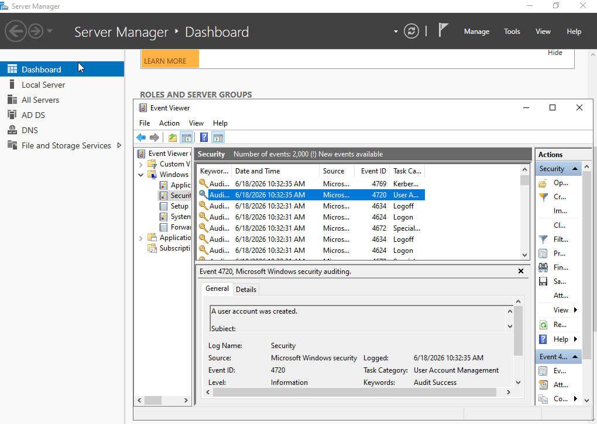

# Active Directory Security Monitoring Lab

## Objective

This project demonstrates the deployment and monitoring of a Windows Active Directory environment. The lab was designed to simulate common security-relevant Active Directory activities and investigate corresponding Windows Security Events from a SOC analyst perspective.

## Environment

### Infrastructure

| System | Role |
|----------|----------|
| Windows Server 2022 | Domain Controller |
| Active Directory Domain Services | Identity Management |
| DNS Server | Name Resolution |
| Splunk Enterprise | Log Collection & Analysis |
| Sysmon | Endpoint Telemetry |

### Domain

corp.local

## Skills Demonstrated

- Active Directory Administration
- Security Monitoring
- Log Analysis
- Incident Investigation
- Detection Engineering
- Windows Event Analysis
- MITRE ATT&CK Mapping
- SOC Operations

## Security Events Investigated

| Event ID | Description |
|----------|-------------|
| 4720 | User Account Created |
| 4724 | Password Reset Attempt |
| 4726 | User Account Deleted |
| 4728 | User Added to Privileged Group |
| 4732 | Security-Enabled Local Group Membership Change |

## Detection Examples

### User Creation Detection

```spl
EventCode=4720
```
### Screenshot

#### Active Directory User Creation




## Password Reset Investigation

### Objective

Investigate Active Directory password reset activity using Windows Security Event ID 4724.

### Action Performed

The password for a domain user account was reset through Active Directory Users and Computers.

### Evidence

| Field | Value |
|---------|---------|
| Event ID | 4724 |
| Description | An attempt was made to reset an account's password |
| Source | Windows Security Log |

### Screenshot

#### Active Directory User Creation - Password Reset


### MITRE ATT&CK

**T1098 - Account Manipulation**

### Detection Logic

```spl
EventCode=4724
```

### Findings

A password reset operation generated Event ID 4724 in the Windows Security Log. Password resets should be reviewed to ensure they were authorized and performed by approved administrators.

### Recommendation

Monitor password reset activity and investigate unexpected administrative account actions.
